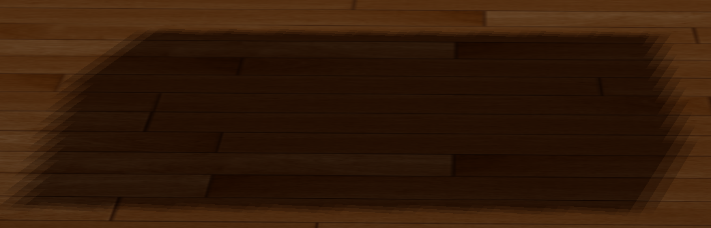

## 实现结果：

- 正交投影下：


- 透视投影下：


- GUI样式
    可以选择投影形式，改变光源颜色，让光源处以移动的状态：
    


## 阴影映射(Shadow Mapping)

阴影映射(Shadow Mapping)背后的思路非常简单：我们以光的位置为视角进行渲染，我们能看到的东西都将被点亮，看不见的一定是在阴影之中了。假设有一个地板，在光源和它之间有一个大盒子。由于光源处向光线方向看去，可以看到这个盒子，但看不到地板的一部分，这部分就应该在阴影中了。

我们希望得到射线第一次击中的那个物体，然后用这个最近点和射线上其他点进行对比。然后我们将测试一下看看射线上的其他点是否比最近点更远，如果是的话，这个点就在阴影中。对从光源发出的射线上的成千上万个点进行遍历是个极端消耗性能的举措，实时渲染上基本不可取。我们可以采取相似举措，不用投射出光的射线。我们所使用的是非常熟悉的东西：深度缓冲。

在深度缓冲里的一个值是摄像机视角下，对应于一个片元的一个0到1之间的深度值。如果我们从光源的透视图来渲染场景，并把深度值的结果储存到纹理中.通过这种方式，我们就能对光源的透视图所见的最近的深度值进行采样。最终，深度值就会显示从光源的透视图下见到的第一个片元了。我们管储存在纹理中的所有这些深度值，叫做深度贴图（depth map）或阴影贴图。

深度映射由两个步骤组成：首先，我们渲染深度贴图，然后我们像往常一样渲染场景，使用生成的深度贴图来计算片元是否在阴影之中。

### 深度贴图

首先，我们要为渲染的深度贴图创建一个帧缓冲对象,然后，创建一个2D纹理，提供给帧缓冲的深度缓冲使用,生成深度贴图不太复杂。因为我们只关心深度值，我们要把纹理格式指定为GL_DEPTH_COMPONENT。我们还要把纹理的高宽设置为1024：这是深度贴图的解析度。再把我们把生成的深度纹理作为帧缓冲的深度缓冲。

```cpp
// configure depth map FBO
// -----------------------
const unsigned int SHADOW_WIDTH = 1024, SHADOW_HEIGHT = 1024;
unsigned int depthMapFBO;
glGenFramebuffers(1, &depthMapFBO);
// create depth texture
unsigned int depthMap;
glGenTextures(1, &depthMap);
glBindTexture(GL_TEXTURE_2D, depthMap);
glTexImage2D(GL_TEXTURE_2D, 0, GL_DEPTH_COMPONENT, SHADOW_WIDTH, SHADOW_HEIGHT, 0, GL_DEPTH_COMPONENT, GL_FLOAT, NULL);
glTexParameteri(GL_TEXTURE_2D, GL_TEXTURE_MIN_FILTER, GL_NEAREST);
glTexParameteri(GL_TEXTURE_2D, GL_TEXTURE_MAG_FILTER, GL_NEAREST);
glTexParameteri(GL_TEXTURE_2D, GL_TEXTURE_WRAP_S, GL_CLAMP_TO_BORDER);
glTexParameteri(GL_TEXTURE_2D, GL_TEXTURE_WRAP_T, GL_CLAMP_TO_BORDER);
float borderColor[] = { 1.0, 1.0, 1.0, 1.0 };
glTexParameterfv(GL_TEXTURE_2D, GL_TEXTURE_BORDER_COLOR, borderColor);
// attach depth texture as FBO's depth buffer
glBindFramebuffer(GL_FRAMEBUFFER, depthMapFBO);
glFramebufferTexture2D(GL_FRAMEBUFFER, GL_DEPTH_ATTACHMENT, GL_TEXTURE_2D, depthMap, 0);
glDrawBuffer(GL_NONE);
glReadBuffer(GL_NONE);
glBindFramebuffer(GL_FRAMEBUFFER, 0);
```

我们需要的只是在从光的透视图下渲染场景的时候深度信息，所以颜色缓冲没有用。然而帧缓冲对象不是完全不包含颜色缓冲的，所以我们需要显式告诉OpenGL我们不适用任何颜色数据进行渲染。我们通过将调用glDrawBuffer和glReadBuffer把读和绘制缓冲设置为GL_NONE来做这件事。

合理配置将深度值渲染到纹理的帧缓冲后，我们就可以开始第一步了：生成深度贴图。两个步骤的完整的渲染阶段，看起来有点像这样：

```cpp
// 1. 首选渲染深度贴图
glViewport(0, 0, SHADOW_WIDTH, SHADOW_HEIGHT);
glBindFramebuffer(GL_FRAMEBUFFER, depthMapFBO);
glClear(GL_DEPTH_BUFFER_BIT);
ConfigureShaderAndMatrices();
RenderScene();
glBindFramebuffer(GL_FRAMEBUFFER, 0);
// 2. 像往常一样渲染场景，但这次使用深度贴图
glViewport(0, 0, SCR_WIDTH, SCR_HEIGHT);
glClear(GL_COLOR_BUFFER_BIT | GL_DEPTH_BUFFER_BIT);
ConfigureShaderAndMatrices();
glBindTexture(GL_TEXTURE_2D, depthMap);
RenderScene();
```
这里一定要记得调用glViewport。因为阴影贴图经常和我们原来渲染的场景（通常是窗口解析度）有着不同的解析度，我们需要改变视口（viewport）的参数以适应阴影贴图的尺寸。如果我们忘了更新视口参数，最后的深度贴图要么太小要么就不完整。


### 光源空间的变换

```cpp
glm::mat4 lightProjection, lightView;
glm::mat4 lightSpaceMatrix;
float near_plane = 1.0f, far_plane = 7.5f;
lightProjection = glm::ortho(-10.0f, 10.0f, -10.0f, 10.0f, near_plane, far_plane);
lightView = glm::lookAt(lightPos, glm::vec3(0.0f), glm::vec3(0.0, 1.0, 0.0));
lightSpaceMatrix = lightProjection * lightView;
```

这个lightSpaceMatrix正是前面我们称为T的那个变换矩阵。有了lightSpaceMatrix只要给shader提供光空间的投影和视图矩阵，我们就能像往常那样渲染场景了。然而，我们只关心深度值，并非所有片元计算都在我们的着色器中进行。为了提升性能，我们将使用一个与之不同但更为简单的着色器来渲染出深度贴图。

### 渲染至深度贴图

当我们以光的透视图进行场景渲染的时候，我们会用一个比较简单的着色器，这个着色器除了把顶点变换到光空间以外，不会做得更多了。这个简单的着色器叫做simpleDepthShader，就是使用下面的这个着色器：

```glsl
#version 330 core
layout (location = 0) in vec3 position;

uniform mat4 lightSpaceMatrix;
uniform mat4 model;

void main()
{
    gl_Position = lightSpaceMatrix * model * vec4(position, 1.0f);
}
```

这个顶点着色器将一个单独模型的一个顶点，使用lightSpaceMatrix变换到光空间中。

由于我们没有颜色缓冲，最后的片元不需要任何处理，所以我们可以简单地使用一个空像素着色器：

```glsl
#version 330 core

void main()
{             
    // gl_FragDepth = gl_FragCoord.z;
}
```

这个空像素着色器什么也不干，运行完后，深度缓冲会被更新。我们可以取消那行的注释，来显式设置深度，但是这个（指注释掉那行之后）是更有效率的，因为底层无论如何都会默认去设置深度缓冲。

渲染深度缓冲现在成了：

```cpp
simpleDepthShader.Use();
glUniformMatrix4fv(lightSpaceMatrixLocation, 1, GL_FALSE, glm::value_ptr(lightSpaceMatrix));

glViewport(0, 0, SHADOW_WIDTH, SHADOW_HEIGHT);
glBindFramebuffer(GL_FRAMEBUFFER, depthMapFBO);
glClear(GL_DEPTH_BUFFER_BIT);
RenderScene(simpleDepthShader);
glBindFramebuffer(GL_FRAMEBUFFER, 0);
```

这里的RenderScene函数的参数是一个着色器程序（shader program），它调用所有相关的绘制函数，并在需要的地方设置相应的模型矩阵。

将深度贴图渲染到四边形上的像素着色器：

```glsl
#version 330 core
out vec4 color;
in vec2 TexCoords;

uniform sampler2D depthMap;

void main()
{             
    float depthValue = texture(depthMap, TexCoords).r;
    color = vec4(vec3(depthValue), 1.0);
}
```

### 渲染阴影

正确地生成深度贴图以后我们就可以开始生成阴影了。这段代码在像素着色器中执行，用来检验一个片元是否在阴影之中，不过我们在顶点着色器中进行光空间的变换：

```glsl
#version 330 core
layout (location = 0) in vec3 aPos;
layout (location = 1) in vec3 aNormal;
layout (location = 2) in vec2 aTexCoords;

out vec2 TexCoords;

out VS_OUT {
    vec3 FragPos;
    vec3 Normal;
    vec2 TexCoords;
    vec4 FragPosLightSpace;
} vs_out;

uniform mat4 projection;
uniform mat4 view;
uniform mat4 model;
uniform mat4 lightSpaceMatrix;

void main()
{
    vs_out.FragPos = vec3(model * vec4(aPos, 1.0));
    vs_out.Normal = transpose(inverse(mat3(model))) * aNormal;
    vs_out.TexCoords = aTexCoords;
    vs_out.FragPosLightSpace = lightSpaceMatrix * vec4(vs_out.FragPos, 1.0);
    gl_Position = projection * view * model * vec4(aPos, 1.0);
}
```

这儿的新的地方是FragPosLightSpace这个输出向量。我们用同一个lightSpaceMatrix，把世界空间顶点位置转换为光空间。顶点着色器传递一个普通的经变换的世界空间顶点位置vs_out.FragPos和一个光空间的vs_out.FragPosLightSpace给像素着色器。

像素着色器使用Blinn-Phong光照模型渲染场景。我们接着计算出一个shadow值，当fragment在阴影中时是1.0，在阴影外是0.0。然后，diffuse和specular颜色会乘以这个阴影元素。由于阴影不会是全黑的（由于散射），我们把ambient分量从乘法中剔除。

```glsl
#version 330 core
out vec4 FragColor;

in VS_OUT {
    vec3 FragPos;
    vec3 Normal;
    vec2 TexCoords;
    vec4 FragPosLightSpace;
} fs_in;

uniform sampler2D diffuseTexture;
uniform sampler2D shadowMap;

uniform vec3 lightPos;
uniform vec3 viewPos;

float ShadowCalculation(vec4 fragPosLightSpace)
{
    // perform perspective divide
    vec3 projCoords = fragPosLightSpace.xyz / fragPosLightSpace.w;
    // transform to [0,1] range
    projCoords = projCoords * 0.5 + 0.5;
    // get closest depth value from light's perspective (using [0,1] range fragPosLight as coords)
    float closestDepth = texture(shadowMap, projCoords.xy).r; 
    // get depth of current fragment from light's perspective
    float currentDepth = projCoords.z;
    // calculate bias (based on depth map resolution and slope)
    vec3 normal = normalize(fs_in.Normal);
    vec3 lightDir = normalize(lightPos - fs_in.FragPos);
    float bias = max(0.05 * (1.0 - dot(normal, lightDir)), 0.005);
    // check whether current frag pos is in shadow
    // float shadow = currentDepth - bias > closestDepth  ? 1.0 : 0.0;
    // PCF
    float shadow = 0.0;
    vec2 texelSize = 1.0 / textureSize(shadowMap, 0);
    for(int x = -1; x <= 1; ++x)
    {
        for(int y = -1; y <= 1; ++y)
        {
            float pcfDepth = texture(shadowMap, projCoords.xy + vec2(x, y) * texelSize).r; 
            shadow += currentDepth - bias > pcfDepth  ? 1.0 : 0.0;        
        }    
    }
    shadow /= 9.0;
    
    // keep the shadow at 0.0 when outside the far_plane region of the light's frustum.
    if(projCoords.z > 1.0)
        shadow = 0.0;
        
    return shadow;
}

void main()
{           
    vec3 color = texture(diffuseTexture, fs_in.TexCoords).rgb;
    vec3 normal = normalize(fs_in.Normal);
    vec3 lightColor = vec3(0.3);
    // ambient
    vec3 ambient = 0.3 * color;
    // diffuse
    vec3 lightDir = normalize(lightPos - fs_in.FragPos);
    float diff = max(dot(lightDir, normal), 0.0);
    vec3 diffuse = diff * lightColor;
    // specular
    vec3 viewDir = normalize(viewPos - fs_in.FragPos);
    vec3 reflectDir = reflect(-lightDir, normal);
    float spec = 0.0;
    vec3 halfwayDir = normalize(lightDir + viewDir);  
    spec = pow(max(dot(normal, halfwayDir), 0.0), 64.0);
    vec3 specular = spec * lightColor;    
    // calculate shadow
    float shadow = ShadowCalculation(fs_in.FragPosLightSpace);                      
    vec3 lighting = (ambient + (1.0 - shadow) * (diffuse + specular)) * color;    
    
    FragColor = vec4(lighting, 1.0);
}
```


## PCF

因为深度贴图有一个固定的解析度，多个片元对应于一个纹理像素。结果就是多个片元会从深度贴图的同一个深度值进行采样，这几个片元便得到的是同一个阴影，这就会产生锯齿边。

你可以通过增加深度贴图解析度的方式来降低锯齿块，也可以尝试尽可能的让光的视锥接近场景。

另一个（并不完整的）解决方案叫做PCF（percentage-closer filtering），这是一种多个不同过滤方式的组合，它产生柔和阴影，使它们出现更少的锯齿块和硬边。核心思想是从深度贴图中多次采样，每一次采样的纹理坐标都稍有不同。每个独立的样本可能在也可能不再阴影中。所有的次生结果接着结合在一起，进行平均化，我们就得到了柔和阴影。

一个简单的PCF的实现是简单的从纹理像素四周对深度贴图采样，然后把结果平均起来：

```glsl
float shadow = 0.0;
vec2 texelSize = 1.0 / textureSize(shadowMap, 0);
for(int x = -1; x <= 1; ++x)
{
    for(int y = -1; y <= 1; ++y)
    {
        float pcfDepth = texture(shadowMap, projCoords.xy + vec2(x, y) * texelSize).r; 
        shadow += currentDepth - bias > pcfDepth ? 1.0 : 0.0;        
    }    
}
shadow /= 9.0;
```

这个textureSize返回一个给定采样器纹理的0级mipmap的vec2类型的宽和高。用1除以它返回一个单独纹理像素的大小，我们用以对纹理坐标进行偏移，确保每个新样本，来自不同的深度值。这里我们采样得到9个值，它们在投影坐标的x和y值的周围，为阴影阻挡进行测试，并最终通过样本的总数目将结果平均化。

本次作业中效果：
