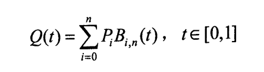
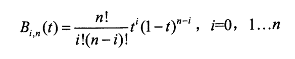

### Bezier算法
- bezier函数如下：

    

    - 其中P为对应点的坐标
    - B的函数如下：
	
    

    因此，要画bezier曲线，就要计算Q(t)函数。
    一步一步来，先求B(t)：
    ```cpp
    int factorial(int n) {
    	int sum = 1;
    	for (int i = 1; i <= n; i++)
    		sum *= i;
    	return sum;
    }

    double Bernstein(int i, int n, double t) {
    	double sum = 0;
    	sum = factorial(n) / (factorial(i) * factorial(n - i)) * pow(t, i) * pow(1 - t, n - i);
    	return sum;
    }
    ```
    先写出求阶乘的函数factorial，然后将B(t)的公式表达出来，也就是上面的Bernstein函数。
    接下来就是计算Q(t)函数：
    ```cpp
    void drawBezierCurve() {
	    if (points.size() > 1) {
		    float length = 0.001f;
		    float count = 1 / length;
		    float t = 0.0f;
		    bezierCurve.clear();

		    for (int m = 0; m < count; m++) {
		    	t += length;
		    	double x = 0, y = 0;

		    	for (auto i = 0; i < points.size(); i++) {
		    		x += points[i].x * Bernstein(i, points.size() - 1, t);
		    		y += points[i].y * Bernstein(i, points.size() - 1, t);
				
		    	}
		    	bezierCurve.push_back(Point(x, y));
		    }
	    }
	    else
	    	bezierCurve.clear();
    }
    ```
    由于n是从0开始计算的，所以数组的size为n+1，所以在计算的时候，要用size-1。

### 标准化的问题
- 在程序运行的时候，xy坐标是用glfwGetCursorPos(window, &xpos, &ypos)得到的，这个数值和最终显示的坐标体系是不同的，因此要把它转化成我们需要的形式。同时因为在渲染的时候我们要传入的顶点是数组的形式，所以需要把标准化后的顶点数据存入数组。
    ```cpp
    float normalizeForX(double x) {
	    float answer = (float)(x - (SCR_WIDTH / 2 - 1)) / (SCR_WIDTH / 2 - 1);
	    if (answer > 1.0f)
	    	answer = 1.0f;
	    return answer;
    }

    float normalizeForY(double y) {
    	float answer = -(float)(y - (SCR_HEIGHT / 2 - 1)) / (SCR_HEIGHT / 2 - 1);
	    if (answer > 1.0f)
	    	answer = 1.0f;
	    return answer;
    }

    void setVertice(vector<Point> *arr, float *floatArr) {
	    for (auto i = 0; i < arr->size(); i++) {
	    	floatArr[i * 3] = normalizeForX((*arr)[i].x);
	    	floatArr[i * 3 + 1] = normalizeForY((*arr)[i].y);
	    	floatArr[i * 3 + 2] = 0;
	    }
    }
    ```

### 动态画图
- 动态画bezier曲线，就是一步一步把计算出来的Q(t)函数画出，从我们点击的位置所在点获取坐标，然后画出过程，也就是将step设置小一点，获取新的点并渲染出来。

    ```cpp
    Point getPointFromCurve(Point A, Point B, double step) {
    	double x = A.x + (B.x - A.x) * step;
    	double y = A.y + (B.y - A.y) * step;
    	Point temp(x, y);
    	return temp;
    }

    void getAnimationPoints(double step, int time, bool isFirst, int alreadyPush) {
    	if (time == 0) {
    		return;
    	}
    	if (isFirst) {
    		for (int i = 0; i < time; i++) {
    			animationCurve.push_back(getPointFromCurve(points[i], points[i + 1], step));
    		}
    	getAnimationPoints(step, time - 1, false, 0);
    	}
    	else {
    		for (int i = alreadyPush; i < time + alreadyPush; i++) {
    			animationCurve.push_back(getPointFromCurve(animationCurve[i], animationCurve[i + 1], step));
    		}
    		getAnimationPoints(step, time - 1, false, alreadyPush + time + 1);
    	}
    }

    void showAnimationCurve(int time, int alreadyShow) {
    	if (time == 0) {
    		return;
    	}
    	for (size_t i = alreadyShow; i < time + alreadyShow; i++) {
    		glDrawArrays(GL_LINES, i, 2);
    	}
	    showAnimationCurve(time - 1, alreadyShow + time + 1);
    }
    ```

### 运行结果
